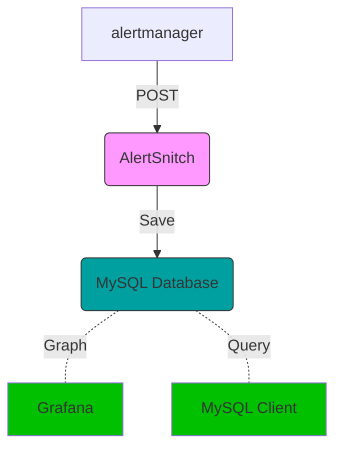

# Alert Snitch

Captures Prometheus alertmanager alerts and writes them in a MySQL instance

## How does it work

Given a noisy enough alerting environment, offline querying capabilities of
triggered alerts is extremely valuable.

1. You stand up one of these
1. You configure the alertmanager to point at it
1. Every alert that gets triggered reaches your MySQL database
1. Profit



Simply install to your $GOPATH using your GO tools

```sh
$ go get gitlab.com/yakshaving.art/alertsnitch`
```

## Requirements

To run Alertsnitch requires a MySQL database to write to.

The database must be initialized with alertsnitch bootstrap and must have all
the available migrations executed.

AlertSnitch will not become online until the model is up to date with the
expected one. For your ease some sample codes are provided hope that helps.

### Sample bootstrapping

```bash
$ mysql --user=${MYSQL_USER} -p -e "CREATE DATABASE alertsnitch CHARACTER SET utf8mb4 COLLATE utf8mb4_unicode_ci;"
$ mysql --user=${MYSQL_USER} -p -e "CREATE USER 'alertsnitch'@'%' IDENTIFIED BY '${PASSWORD}';"
$ mysql --user=${MYSQL_USER} -p -e "GRANT ALL PRIVILEGES ON alertsnitch.* TO 'alertsnitch'@'%' IDENTIFIED BY '${PASSWORD}';"
$ mysql --user=alertsnitch -p${PASSWORD} alertsnitch < db.d/0.0.1-bootstrap.sql
$ mysql --user=alertsnitch -p${PASSWORD} alertsnitch < db.d/0.1.0-fingerprint.sql
```

### Sample DSN

For specifics about how to set up the DSN refer to [Go MySQL client driver][1]

This is a sample of a DSN that would connect to the local host over a unix socket

```bash
export ALERTSNITCH_MYSQL_DSN="alertsnitch:${PASSWORD}@/alertsnitch"
```

## How to run
### Running alertsnitch in Docker
**Run using docker in this very registry, for ex.**

```sh
$ docker run --rm \
    -p 9567:9567 \
    -e ALERTSNITCH_MYSQL_DSN \
    registry.gitlab.com/yakshaving.art/alertsnitch
```

### To run in ubuntu system, open terminal and run the following

**First copy the alertsnitch binary from your $GOPATH to /usr/local/bin**
```sh
$ sudo cp ~/go/bin/alertsnitch /usr/local/bin
```
**Now run alertsnitch as**
```sh
$ alertsnitch
```
**Or to simply see the alerts received on your terminal run :**
```sh
$ alertsnitch --dryrun
```
### Arguments

* **-debug** dumps the received webhook payloads to the log so you can understand what is going on
* **-dryrun** uses a null db driver that writes received webhooks to stdout
* **-listen.address** _string_ address in which to listen for http requests (default ":9567")
* **-version** prints the version and exit


## Usage

Once AlertSnitch is up and running, configure the Prometheus Alert Manager to
forward every alert to it on the `/webhooks` path.

```yaml
---
receivers:
- name: alertsnitch
  webhook_configs:
    - url: http://<alertsnitch-ip>:9567/webhook
```

And add the route

```yaml
# We want to send all alerts to alertsnitch and then continue to the
# appropiate handler.
route:
  routes:
  - receiver: alertsnitch
    continue: true
```

## Readiness probe

AlertSnitch offers a `/-/ready` endpoint which will return 200 if the
application is ready to accept webhook posts.

During startup AlertSnitch will probe the MySQL database and the database
model version. If everything is as expected it will set itself as ready.

In case of failure it will return a 500 and will write the error in the
response payload.

## Liveliness probe

AlertSnitch offers a `/-/health` endpoint which will return 200 as long as
the MySQL database is reachable.

In case of error it will return a 500 and will write the error in the
response payload.

## Metrics

AlertSnitch provides Prometheus metrics on `/metrics` as per prometheus
convention.

## Security

There is no offering of security of any kind. AlertSnitch is not ment to be
exposed to the internet but to be executed in an internal network reachable
by the alert manager.

## Grafana Compatibility

AlertSnitch writes alerts in such a way thay they can be explored using
Grafana's MySQL Data Source plugin. Refer to Grafana documentation for
further instructions.

## Testing locally

We provide a couple of Makefile tasks to make it easy to run integration tests
locally, to get a full coverage sample run:

```sh
make bootstrap_local_testing
make integration
go tool cover -html=coverage.out
make teardown_local_testing
```

[1]: https://github.com/go-sql-driver/mysql
