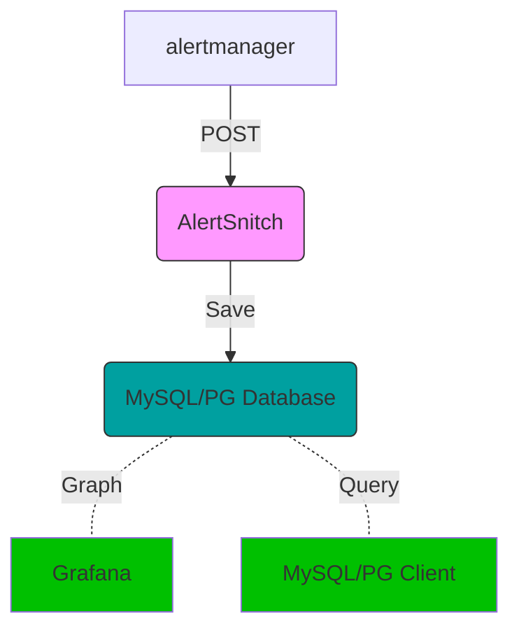

# AlertSnitch

Captures Prometheus AlertManager alerts and writes them in a MySQL or
Postgres database for future examination.

Because given a noisy enough alerting environment, offline querying
capabilities of triggered alerts is extremely valuable.

## How does it work

1. You stand up one of these however you like (multi-arch Docker images provided)
1. You setup AlertManager to point at it and propagate your alerts in.
1. Every alert that gets triggered reaches your database.
1. Profit.



## Local install

Simply install to your $GOPATH using your GO tools

```sh
$ go get gitlab.com/yakshaving.art/alertsnitch`
```

## Requirements

To run AlertSnitch requires a MySQL or Postgres database to write to.

The database must be initialized with AlertSnitch model.

AlertSnitch will not become online until the model is up to date with the
expected one. Bootstrapping scripts are provided in the [scripts][./script.d]
folder.

## Configuration

### MySQL

For specifics about how to set up the MySQL DSN refer to [Go MySQL client driver][1]

This is a sample of a DSN that would connect to the local host over a Unix socket

```bash
export ALERTSNITCH_BACKEND="mysql"
export ALERTSNITCH_DSN="${MYSQL_USER}:${MYSQL_PASSWORD}@/${MYSQL_DATABASE}"
```

### Postgres

```bash
export ALERTSNITCH_BACKEND="postgres"
export ALERTSNITCH_DSN="sslmode=disable user=${PGUSER} password=${PGPASSWORD} host=${PGHOST} database=${PGDATABASE}"
```

## How to run

### Running with Docker

**Run using docker in this very registry, for ex.**

```sh
$ docker run --rm \
    -p 9567:9567 \
    -e ALERTSNITCH_DSN \
    -e ALERTSNITCH_BACKEND \
    registry.gitlab.com/yakshaving.art/alertsnitch
```

### Running Manually

1. Open a terminal and run the following
1. Copy the AlertSnitch binary from your $GOPATH to `/usr/local/bin` with `sudo cp ~/go/bin/alertsnitch /usr/local/bin`
1. Now run AlertSnitch as with just `alertsnitch`
   - To just see the alerts that are being received, use the *null* backend with `ALERTSNITCH_BACKEND=null`

### Setting up in AlertManager

Once AlertSnitch is up and running, configure the Prometheus Alert Manager to
forward every alert to it on the `/webhooks` path.

```yaml
---
receivers:
- name: alertsnitch
  webhook_configs:
    - url: http://<alertsnitch-host-or-ip>:9567/webhook
```

Then add the route

```yaml
# We want to send all alerts to alertsnitch and then continue to the
# appropiate handler.
route:
  routes:
  - receiver: alertsnitch
    continue: true
```

### Command line arguments

* **-database-backend** sets the database backend to connect to, supported are `mysql`, `postgres` and `null`
* **-debug** dumps the received WebHook payloads to the log so you can understand what is going on
* **-listen.address** _string_ address in which to listen for HTTP requests (default ":9567")
* **-version** prints the version and exit

### Environment variables

- **ALERTSNITCH_DSN** *required* database connection query string
- **ALERTSNITCH_ADDR** same as **-listen.address**
- **ALERTSNITCH_BACKEND**  same as **-database-backend**

### Readiness probe

AlertSnitch offers a `/-/ready` endpoint which will return 200 if the
application is ready to accept WebHook posts.

During startup AlertSnitch will probe the MySQL database and the database
model version. If everything is as expected it will set itself as ready.

In case of failure it will return a 500 and will write the error in the
response payload.

### Liveliness probe

AlertSnitch offers a `/-/health` endpoint which will return 200 as long as
the MySQL/Postgres database is reachable.

In case of error it will return a 500 and will write the error in the
response payload.

### Metrics

AlertSnitch provides Prometheus metrics on `/metrics` as per Prometheus
convention.

### Security

There is no offering of security of any kind. AlertSnitch is not ment to be
exposed to the internet but to be executed in an internal network reachable
by the alert manager.

### Grafana Compatibility

AlertSnitch writes alerts in such a way that they can be explored using
Grafana's MySQL/Postgres Data Source plugin. Refer to Grafana documentation
for further instructions.

## Testing locally

We provide a couple of Makefile tasks to make it easy to run integration tests
locally, to get a full coverage sample run:

```sh
make bootstrap_local_testing
make integration
go tool cover -html=coverage.out
make teardown_local_testing
```

[1]: https://github.com/go-sql-driver/mysql
